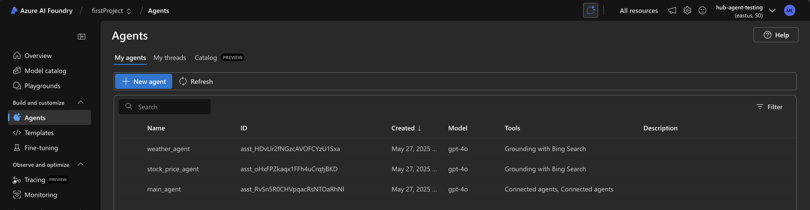
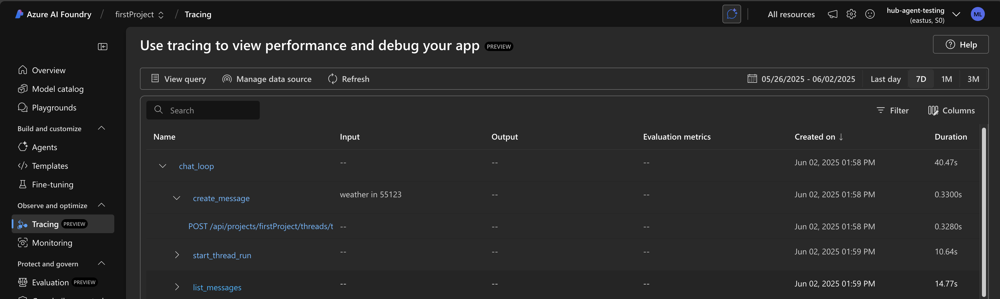
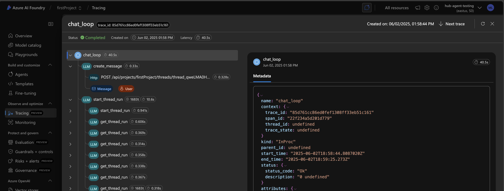
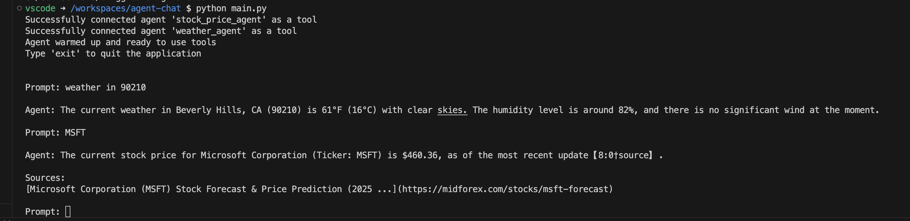

# Azure AI Agent Chat Application

> [!NOTE]
> This project was a quick POC not meant for prduction use.

This project demonstrates how to build a multi-agent system using Azure AI Foundry. It includes a main agent that can delegate tasks to specialized agents for handling specific queries about stock prices and weather information. Tracing is implemented using Azure Application Insights, and the agents can utilize Bing Search for grounding capabilities.

Agents are created in Azure AI Foundry, and the application uses the Azure AI Projects Python SDK to interact with these agents. The main agent coordinates with specialized agents to provide accurate and relevant responses to user queries.



Tracing is implemented to monitor the interactions between agents and the user. The application provides a simple command-line interface for users to interact with the agents, allowing them to ask questions and receive responses based on the agents' capabilities.





## Prompt Example

The image below shows an example of how to interact with the agents. The main agent routes specific queries to specialized agents (weather, stock prices) that can provide accurate, grounded information.



## Features

- **Multi-agent architecture**: Main agent coordinates with specialized agents
- **Agent tools**: Integration with Bing Search for grounding capabilities
- **Telemetry**: Azure Application Insights integration for monitoring
- **Interactive chat**: Simple command-line interface for interacting with agents

## Prerequisites

- Azure account with access to Azure AI Services
- Azure AI Foundry project set up with appropriate permissions
- Application Insights resource (for telemetry and tracing)
- Bing Search resource configured as a grounding connection in AI Foundry

### Creating Required Azure Resources

1. **Azure AI Foundry project**: Create through the [Azure Portal](https://portal.azure.com) or [Azure CLI](https://docs.microsoft.com/en-us/cli/azure/)
2. **Application Insights**: Set up through Azure Portal and get the connection string
3. **Bing Search Connection**: Configure in your AI Foundry project for grounding capabilities

## Setup

### Using Dev Container

This project includes a dev container configuration for Visual Studio Code, which provides a fully configured development environment with all required dependencies pre-installed.

**Prerequisites:**
- [Docker](https://www.docker.com/products/docker-desktop/)
- [Visual Studio Code](https://code.visualstudio.com/)
- [VS Code Remote - Containers extension](https://marketplace.visualstudio.com/items?itemName=ms-vscode-remote.remote-containers)

**Steps:**
1. Clone this repository
2. Open the project in VS Code
3. When prompted to "Reopen in Container", click "Reopen in Container". Alternatively, press F1, type "Remote-Containers: Reopen in Container" and press Enter
4. Wait for the container to build and start (this may take a few minutes the first time)
5. Copy `.env.template` to `.env` and update with your Azure resource values:
   - `PROJECT_ENDPOINT`: Your Azure AI Foundry project endpoint URL
   - `APP_INSIGHTS_CONNECTION_STRING`: Connection string for Azure Application Insights
   - `BING_CONNECTION_NAME`: Full resource ID for your Bing grounding connection
6. Run the application with `python main.py`

## Usage

Login and remembner to choose the correct Azure subscription if you have multiple

```bash
az login
```

Run the application:

```bash
python main.py
```

To use an existing thread:

```bash
python main.py --thread <thread-id>
```

Type your questions in the prompt and the agents will respond accordingly.
Type 'exit' to quit the application.

## Project Structure

- `main.py`: Entry point for the application
- `agent_service.py`: Service for creating and managing agents
- `agent_instructions.py`: Instructions for specialized and main agents
- `config.py`: Configuration settings using Pydantic
- `.env.template`: Template for environment variables configuration
- `.devcontainer/`: Dev container configuration for VS Code

## References

- [Azure AI Projects Python SDK](https://learn.microsoft.com/en-us/python/api/overview/azure/ai-projects-readme?view=azure-python-preview)
- [Azure AI Services Agents Quickstart](https://learn.microsoft.com/en-us/azure/ai-services/agents/quickstart?pivots=programming-language-python-azure)
- [Azure AI Services Bing Tool Code Samples](https://learn.microsoft.com/en-us/azure/ai-services/agents/how-to/tools/bing-code-samples?pivots=python)

## License

MIT